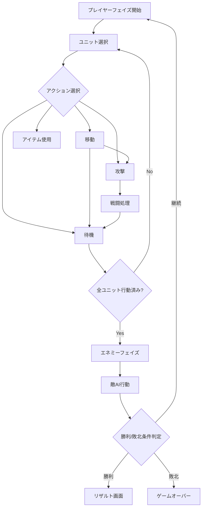

# ゲーム設計書（Game Design Document）

## 1. ゲーム概要

| 項目 | 内容 |
|------|------|
| タイトル | **Tactics Flame**（仮称） |
| ジャンル | シミュレーションRPG（SRPG） |
| プラットフォーム | Android |
| 対象バージョン | Android 8.0（API 26）以上 |
| 言語 | Kotlin |
| フレームワーク | LibGDX |
| 画面向き | 横画面（Landscape） |
| 解像度基準 | 1920×1080（スケーリング対応） |

## 2. ゲームコンセプト

ファイアーエムブレムにインスパイアされた、ターン制のタクティカルRPG。
プレイヤーはユニットを指揮し、グリッドベースのマップ上で敵軍を撃破する。

### コアループ
```
ストーリー/会話 → マップ選択 → 戦闘準備 → ターン制バトル → リザルト → 成長/編成
```

## 3. ゲームシステム

### 3.1 マップ・フィールド

- **グリッドシステム**: 正方形タイルによるマス目ベースのマップ
- **マップサイズ**: 最小 10×10 ～ 最大 20×20
- **地形タイプ**:

| 地形 | 移動コスト | 回避補正 | 防御補正 | 説明 |
|------|-----------|---------|---------|------|
| 平地 | 1 | 0 | 0 | 標準的な地形 |
| 森 | 2 | +20 | +1 | 隠れやすい |
| 山 | 3 | +30 | +2 | 高所の利 |
| 砦 | 1 | +20 | +3 | 守りやすい、HP回復 |
| 水域 | 通行不可 | - | - | 一部ユニットのみ通行可 |
| 壁 | 通行不可 | - | - | 障害物 |

### 3.2 ユニットシステム

#### ステータス
| パラメータ | 略称 | 説明 |
|-----------|------|------|
| HP | HP | 体力（0で戦闘不能） |
| 力 | STR | 物理攻撃力 |
| 魔力 | MAG | 魔法攻撃力 |
| 技 | SKL | 命中率・必殺率に影響 |
| 速さ | SPD | 追撃判定・回避率に影響 |
| 幸運 | LCK | 必殺回避・各種判定に影響 |
| 守備 | DEF | 物理ダメージ軽減 |
| 魔防 | RES | 魔法ダメージ軽減 |
| 移動 | MOV | 移動可能マス数 |

#### クラス（兵種）
| クラス | タイプ | 移動 | 武器 | 特徴 |
|--------|-------|------|------|------|
| ロード | 歩兵 | 5 | 剣 | 主人公専用、バランス型 |
| ソードファイター | 歩兵 | 5 | 剣 | 速さが高い |
| ランサー | 歩兵 | 5 | 槍 | 守備が高い |
| アクスファイター | 歩兵 | 5 | 斧 | 力が高い |
| アーチャー | 歩兵 | 5 | 弓 | 射程2、飛行特効 |
| メイジ | 歩兵 | 5 | 魔法 | 魔力が高い |
| ヒーラー | 歩兵 | 5 | 杖 | HP回復 |
| ナイト | 騎馬 | 7 | 剣,槍 | 移動力が高い |
| ペガサスナイト | 飛行 | 7 | 槍 | 地形無視移動 |
| アーマーナイト | 重装 | 4 | 槍 | 守備が非常に高い |

### 3.3 武器三すくみ

```
剣 → 斧（有利）→ 槍（有利）→ 剣（有利）
```

- 有利側: 命中+15、ダメージ+1
- 不利側: 命中-15、ダメージ-1

### 3.4 戦闘計算式

```
■ 物理ダメージ = 攻撃側STR + 武器威力 - 防御側DEF
■ 魔法ダメージ = 攻撃側MAG + 魔法威力 - 防御側RES
■ 命中率 = 武器命中 + SKL×2 + LCK÷2 - 相手回避
■ 回避率 = SPD×2 + LCK÷2 + 地形回避補正
■ 必殺率 = SKL÷2 - 相手LCK÷2（最低0%）
■ 必殺ダメージ = 通常ダメージ × 3
■ 追撃条件 = 攻撃側SPD - 防御側SPD ≥ 5
```

### 3.5 ターン進行



### 3.6 勝利・敗北条件

- **勝利条件**（マップごとに設定）:
  - 敵全滅
  - ボス撃破
  - 特定地点到達
  - 指定ターン防衛
- **敗北条件**:
  - 主人公ユニット（ロード）の戦闘不能
  - 護衛対象の戦闘不能

### 3.7 成長システム

- 戦闘で経験値を獲得（敵撃破: 基本EXP + レベル差補正）
- 100EXP でレベルアップ
- レベルアップ時、各ステータスが成長率に応じてランダムに上昇

## 4. UI/画面設計

### 画面一覧
| 画面 | 説明 |
|------|------|
| タイトル画面 | ゲーム開始、続きから、設定 |
| ワールドマップ | ストーリー進行、マップ選択 |
| 出撃準備画面 | ユニット編成、装備変更 |
| バトル画面 | メインのゲームプレイ画面 |
| 戦闘アニメ画面 | ユニット同士の戦闘演出 |
| リザルト画面 | 戦闘結果、経験値、報酬 |
| ステータス画面 | ユニット詳細情報 |
| 設定画面 | 音量、アニメ速度 等 |

###操作方法（タッチ操作）
| 操作 | アクション |
|------|-----------|
| タップ | ユニット選択 / マス選択 / 決定 |
| 長押し | ユニット情報表示 / 地形情報表示 |
| ドラッグ | マップスクロール |
| ピンチ | マップ拡大・縮小 |

## 5. 開発フェーズ

### Phase 1: プロトタイプ（MVP）
- [ ] マップ表示（グリッドタイル描画）
- [ ] ユニット配置・移動
- [ ] 基本戦闘（攻撃・ダメージ計算）
- [ ] ターン制進行
- [ ] 簡易敵AI

### Phase 2: コアシステム
- [ ] 武器三すくみ
- [ ] 地形効果
- [ ] レベルアップ・成長
- [ ] 複数クラス対応
- [ ] 戦闘アニメーション

### Phase 3: コンテンツ
- [ ] ストーリーモード（5章以上）
- [ ] ワールドマップ
- [ ] 出撃準備画面
- [ ] BGM・SE

### Phase 4: ポリッシュ
- [ ] UI改善・演出強化
- [ ] バランス調整
- [ ] セーブ/ロード
- [ ] チュートリアル
