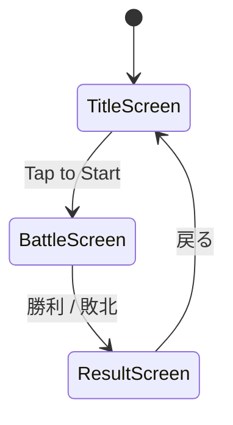

# 01. ゲーム概要

## 基本情報

| 項目 | 内容 |
|------|------|
| タイトル | **Tactics Flame**（仮称） |
| ジャンル | シミュレーションRPG（SRPG） |
| プラットフォーム | Android（API 26+） / Desktop（開発用） |
| 画面向き | 横画面（Landscape） |
| 解像度基準 | 1920×1080（FitViewport でスケーリング） |
| 言語 | Kotlin |
| フレームワーク | LibGDX 1.12.1 |

## コンセプト

ファイアーエムブレムにインスパイアされた、ターン制タクティカルRPG。
プレイヤーはユニットを指揮し、グリッドベースのマップ上で敵軍を撃破する。

## コアループ

```
ストーリー/会話 → マップ選択 → 戦闘準備 → ターン制バトル → リザルト → 成長/編成
```

## 画面遷移



> **注記**: 現在の実装では TitleScreen → BattleScreen → ResultScreen の3画面のみ。
> ワールドマップ・出撃準備・設定画面は未実装。

## 画面一覧

| 画面 | 状態 | 説明 |
|------|------|------|
| TitleScreen | ✅ 実装済み | 「Tap to Start」でバトル画面へ遷移 |
| BattleScreen | ✅ 実装済み | メインのゲームプレイ画面 |
| ResultScreen | ✅ 実装済み | 勝利/敗北メッセージ表示 |
| WorldMapScreen | ❌ 未実装 | ストーリー進行、マップ選択 |
| PrepareScreen | ❌ 未実装 | ユニット編成、装備変更 |
| SettingsScreen | ❌ 未実装 | 音量、アニメ速度 等 |
