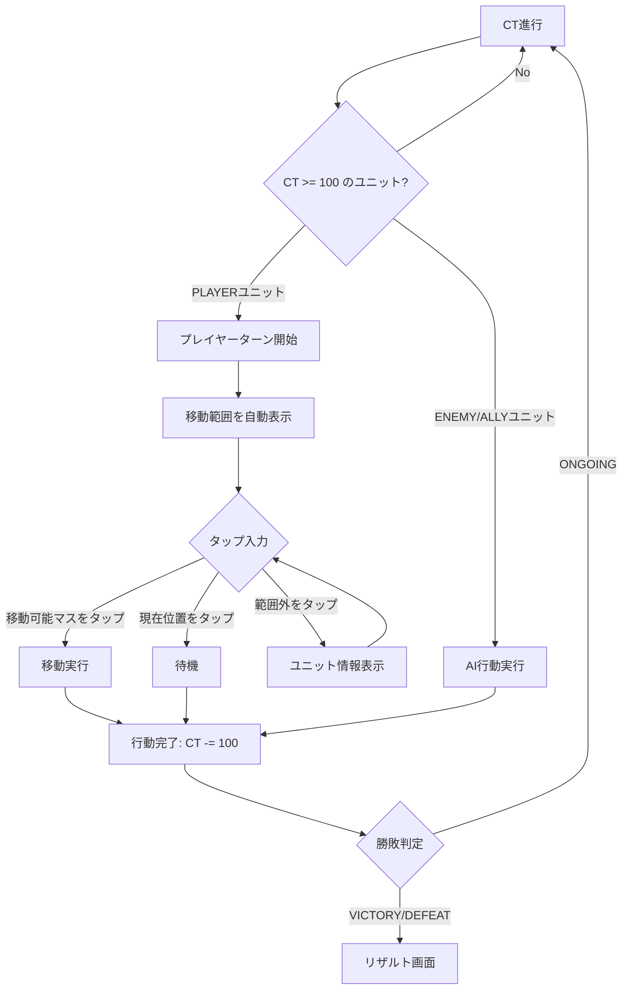
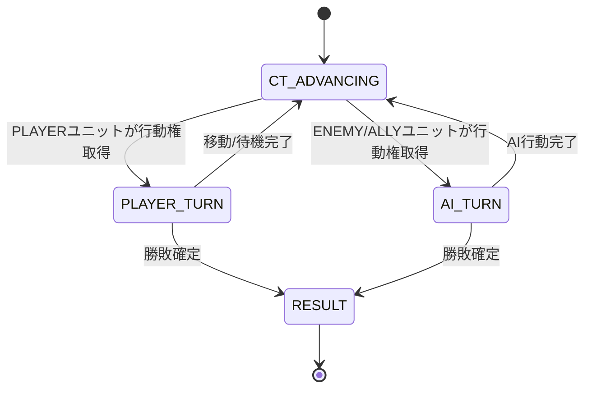

# 06. ターン進行仕様（CTベース個別ターン制）

## 概要

従来のチーム毎フェイズ制（PLAYER → ENEMY → ALLY）を廃止し、
**CT（チャージタイム）ベースの個別ユニットターン制**を採用。

各ユニットのSPD（素早さ）に基づいてCTが蓄積され、
CTが閾値に達したユニットから順に行動する。
素早いユニットほど頻繁に行動できるリアルタイムストラテジー風のシステム。

## CTシステム

### 基本ルール

| 項目 | 値 | 説明 |
|------|-----|------|
| CT閾値 | 100 (`GameConfig.CT_THRESHOLD`) | 行動に必要なCT値 |
| CT加算 | SPD（最低1） | 毎ティック全生存ユニットに加算 |
| 行動後 | CT -= 100 | 超過分は持ち越し（高速ユニット有利） |
| 初期CT | 0 | バトル開始時は全員0 |

### CTの流れ

```
[バトル開始] CT = 0
    ↓
[ティック] 全生存ユニット: CT += SPD
    ↓
[CT >= 100?]
    ├─ No → [ティック]に戻る
    └─ Yes → 最もCTが高いユニットが行動
                ├─ PLAYERユニット → プレイヤー操作待ち
                └─ ENEMY/ALLYユニット → AI自動行動
                    ↓
                [行動完了] CT -= 100（超過持ち越し）
                    ↓
                [勝敗判定]
                    ├─ 勝利/敗北 → リザルト画面
                    └─ 継続 → [ティック]に戻る
```

### 行動順の優先度（同時にCT >= 100のユニットがいる場合）

1. **CT値が高い**ユニットが優先
2. CT値が同じ場合、**SPDが高い**ユニットが優先

### CT蓄積の例（テストデータ）

| ユニット | SPD | 初回行動ティック | CT値（行動時） |
|---------|-----|----------------|---------------|
| 盗賊 | 9 | 12ティック | 108 |
| アレス | 8 | 13ティック | 104 |
| マリア | 7 | 15ティック | 105 |
| リーナ | 5 | 20ティック | 100 |
| 山賊A | 4 | 25ティック | 100 |
| 山賊B | 3 | 34ティック | 102 |

> SPD=9の盗賊はSPD=3の山賊Bの約3倍の頻度で行動する。

## TurnManager

| プロパティ | 型 | 説明 |
|-----------|-----|------|
| `roundNumber` | Int | 現在のラウンド番号（全生存ユニット行動完了で+1） |
| `activeUnit` | GameUnit? | 現在行動中のユニット |
| `totalActions` | Int | 累計行動回数 |

| メソッド | 説明 |
|---------|------|
| `advanceToNextUnit(units)` | CTを進行し、行動権を得たユニットを返す |
| `completeAction(unit, allUnits)` | ユニットの行動完了処理（CT消費・ラウンド更新） |
| `predictActionOrder(units, count)` | 今後の行動順を予測する（UI表示用） |
| `reset(units)` | ターン管理と全ユニットのCTをリセット |

## ラウンドカウント

- 各生存ユニットが1回ずつ行動するとラウンド+1
- 「行動済み」は `actedThisRound` セットで追跡
- 全生存ユニットのIDがセットに含まれるとラウンド更新＆セットクリア
- `SURVIVE_TURNS` 勝利条件ではこのラウンド番号を使用

## プレイヤーユニットの行動フロー



> プレイヤーユニットのターン開始時、そのユニットが自動的に選択され移動範囲が表示される。
> ユニットの選択は不要（CTシステムでは行動するユニットが一意に決まるため）。

## AIユニットの行動フロー

```
1. advanceToNextUnit() → ENEMY/ALLYユニットが行動権取得
2. 陣営に応じたAIパターンで行動決定:
   - ENEMY → AGGRESSIVE パターン
   - ALLY → DEFENSIVE パターン
3. 移動・攻撃を実行
4. completeAction() → CT -= 100
5. 勝敗判定 → 継続ならCT進行に戻る
```

## 勝敗判定

`VictoryChecker.checkOutcome()` で判定。各ユニットの行動完了後に実行。

### 勝利条件タイプ

| 値 | 説明 | 実装状況 |
|-----|------|---------|
| `DEFEAT_ALL` | 敵全滅 | ✅ 実装済み |
| `DEFEAT_BOSS` | ボス撃破 | ✅ 実装済み |
| `SURVIVE_TURNS` | 指定ラウンド防衛 | ✅ 実装済み（ラウンド番号を使用） |
| `REACH_POINT` | 特定地点到達 | ❌ 未実装 |

### 敗北条件

- **ロード（isLord = true）が戦闘不能** → 即敗北
- 現在のテストマップは `DEFEAT_ALL` を使用

### BattleOutcome

| 値 | 説明 |
|-----|------|
| `ONGOING` | 戦闘継続 |
| `VICTORY` | 勝利 |
| `DEFEAT` | 敗北 |

## BattleState（画面状態遷移）



| 状態 | 説明 |
|------|------|
| `CT_ADVANCING` | CTを進行中（次の行動ユニットを決定中） |
| `PLAYER_TURN` | プレイヤーユニットのターン（移動先選択待ち） |
| `AI_TURN` | AIユニットのターン（自動行動実行中） |
| `RESULT` | 勝利/敗北 |

## UI表示

### 行動順キュー

- 画面左側にパネル表示
- 今後行動する8ユニットを順番に表示
- 陣営カラー（青=PLAYER、赤=ENEMY、緑=ALLY）で色分け
- `TurnManager.predictActionOrder()` で予測

### アクティブユニット表示

- 行動中のユニットに金色のリングを描画
- 画面上部中央に「Round X」と「[ユニット名] のターン」を表示

### CTバー

- 各ユニットの下部に小さなCTバーを表示
- CT割合に応じた色変化:
  - 80%以上: 金色（もうすぐ行動）
  - 50%以上: 水色
  - 50%未満: 灰色

### ステータスパネル

- HPバーに加えてCTバーも表示
- CT値を「CT 85 / 100」形式で数値表示

## 未実装の項目

- [ ] アクション選択メニュー（移動後に攻撃/待機/アイテムの選択）
- [ ] 砦でのHP自動回復（ラウンド開始時）
- [ ] 特定地点到達による勝利条件
- [ ] CT進行アニメーション（バー蓄積の視覚的演出）
- [ ] 行動キャンセル（移動後のキャンセル機能）
