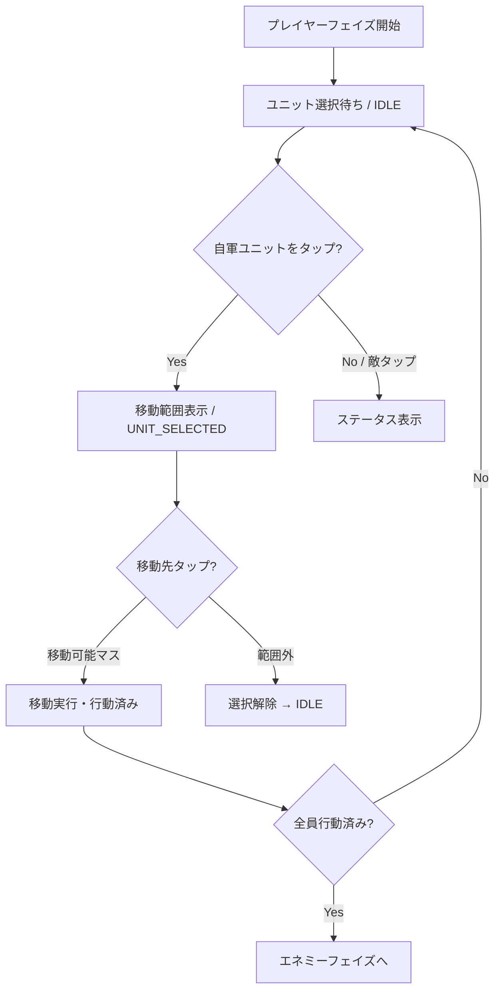

# 06. ターン進行仕様

## フェイズ制

3フェイズのサイクルで 1 ターンを構成する。

```
PLAYER → ENEMY → ALLY → (ターン番号+1) → PLAYER → ...
```

| フェイズ | 操作 | 説明 |
|---------|------|------|
| `PLAYER` | 手動操作 | プレイヤーが全ユニットの行動を指示 |
| `ENEMY` | AI自動 | 敵軍がAIパターンに従い行動 |
| `ALLY` | AI自動 | 同盟軍がAI（防御パターン）で行動 |

## TurnManager

| プロパティ | 型 | 説明 |
|-----------|-----|------|
| `turnNumber` | Int | 現在のターン番号（1始まり） |
| `currentPhase` | Phase | 現在のフェイズ |

| メソッド | 説明 |
|---------|------|
| `advancePhase()` | 次のフェイズに進める。ALLY→PLAYER 時にターン+1 |
| `currentFaction()` | 現在のフェイズに対応する陣営を返す |
| `startPhase(units)` | 該当陣営の生存ユニットの `hasActed` をリセット |
| `allUnitsActed(units)` | 該当陣営の全ユニットが行動済みか判定 |
| `reset()` | ターン1・PLAYERフェイズに初期化 |

## プレイヤーフェイズの行動フロー



> **注記**: 現在の実装では移動後に即 `hasActed = true` となる。
> GDD仕様の「移動後に攻撃/待機を選択」（ACTION_SELECT）は未実装。

## エネミーフェイズのフロー

```
1. advancePhase() → ENEMY
2. startPhase() → 敵全員の hasActed をリセット
3. 各敵ユニットの AI 行動を実行（AISystem.decideAction）
4. 敵全員行動済み
5. 勝敗判定
6. ONGOING → ALLYフェイズ or PLAYERフェイズへ
```

## アライフェイズのフロー

```
1. advancePhase() → ALLY
2. 同盟ユニットが存在する場合のみ実行
3. startPhase() → 同盟全員の hasActed をリセット
4. 各同盟ユニットが AI（DEFENSIVE パターン）で行動
5. advancePhase() → PLAYER（ターン+1）
```

> 同盟ユニットが 0 の場合、ALLYフェイズはスキップされる。

## 勝敗判定

`VictoryChecker.checkOutcome()` で判定。

### 勝利条件タイプ

| 値 | 説明 | 実装状況 |
|-----|------|---------|
| `DEFEAT_ALL` | 敵全滅 | ✅ 実装済み |
| `DEFEAT_BOSS` | ボス撃破 | ✅ 実装済み |
| `SURVIVE_TURNS` | 指定ターン防衛 | ✅ 実装済み |
| `REACH_POINT` | 特定地点到達 | ❌ 未実装 |

### 敗北条件

- **ロード（isLord = true）が戦闘不能** → 即敗北
- 現在のテストマップは `DEFEAT_ALL` を使用

### BattleOutcome

| 値 | 説明 |
|-----|------|
| `ONGOING` | 戦闘継続 |
| `VICTORY` | 勝利 |
| `DEFEAT` | 敗北 |

## 行動済みフラグとリセット

| タイミング | 処理 |
|-----------|------|
| ユニット行動完了時 | `unit.hasActed = true` |
| フェイズ開始時 | `startPhase()` で該当陣営の生存ユニットを `hasActed = false` にリセット |

## 未実装の項目

- [ ] アクション選択メニュー（移動後に攻撃/待機/アイテムの選択）
- [ ] 手動ターン終了コマンド（全員行動前でも次のフェイズへ進める）
- [ ] 砦でのHP自動回復（ターン開始時）
- [ ] 特定地点到達による勝利条件
