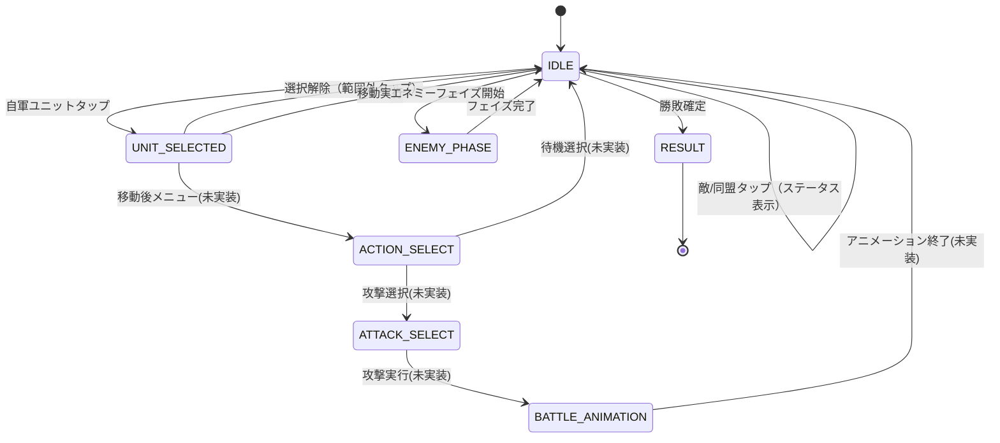

# 08. バトルUI仕様

## 画面構成

BattleScreen はタクティカル戦闘画面で、以下の要素で構成される。

| 要素 | 描画方法 | 説明 |
|------|---------|------|
| マップグリッド | ShapeRenderer（line） | 48×48px グリッド線 |
| 地形 | ShapeRenderer（filled） | 地形タイプごとの色分け |
| ユニット | ShapeRenderer（filled） | 陣営カラーの円 |
| 移動範囲 | ShapeRenderer（filled） | 半透明青の矩形 |
| ステータスパネル | ShapeRenderer + BitmapFont | 選択ユニットの詳細情報 |
| フェイズ情報 | BitmapFont | ターン数・現在フェイズ |

## 座標系

- **FitViewport**: 800×480 の論理解像度
- **カメラ**: viewport 中央に固定（`viewport.apply(true)` でセンタリング）
- **タイルサイズ**: 48×48 ピクセル
- **タッチ座標変換**: `viewport.unproject()` でスクリーン座標 → ワールド座標

## 地形の色分け

| 地形タイプ | 色 | RGB |
|-----------|-----|-----|
| PLAIN | 薄緑 | (0.6, 0.8, 0.4) |
| FOREST | 深緑 | (0.2, 0.6, 0.2) |
| MOUNTAIN | 灰色 | (0.5, 0.5, 0.5) |
| RIVER | 青 | (0.3, 0.5, 0.9) |
| FORT | 茶色 | (0.6, 0.4, 0.2) |
| WALL | 暗灰 | (0.3, 0.3, 0.3) |

## ユニットの描画

陣営ごとに円の色が異なる:

| 陣営 | 色 | RGB |
|------|-----|-----|
| PLAYER | 青 | (0.2, 0.4, 0.9) |
| ENEMY | 赤 | (0.9, 0.2, 0.2) |
| ALLY | 緑 | (0.2, 0.9, 0.4) |

- 描画: タイル中央に半径 16px の円
- 行動済み: **半透明**（alpha 低下）で表示

## BattleState 状態遷移



### 現在実装済みの遷移

| 遷移 | トリガー | 処理 |
|------|---------|------|
| IDLE → UNIT_SELECTED | 未行動の自軍ユニットをタップ | 移動範囲を計算・表示 |
| UNIT_SELECTED → IDLE | 移動可能マスをタップ | ユニット移動 → hasActed = true |
| UNIT_SELECTED → IDLE | 範囲外タップ | 選択解除 |
| IDLE → ステータス表示 | 敵/同盟ユニットタップ | inspectedUnit にセット |
| IDLE → ENEMY_PHASE | 全自軍行動済み | AI行動実行 |
| ENEMY_PHASE → IDLE/ALLY | AI行動完了 | 勝敗判定 → 次フェイズ |

## ステータスパネル

### 表示トリガー

- 任意のユニット（敵含む）をタップすると `inspectedUnit` にセットされ表示
- 自軍ユニットの移動範囲表示中も、選択中ユニットのステータスを表示
- 空マスをタップするとパネル非表示

### パネルレイアウト

```
┌─────────────────────────────┐ ← 画面右端, Y=60
│ ユニット名                    │
│ Lv.XX  クラス名              │
│                              │
│ HP ████████░░  25/30         │
│                              │
│ STR: 10  MAG:  5             │
│ SKL:  8  SPD: 12             │
│ LCK:  7  DEF:  6             │
│ RES:  4  MOV:  5             │
│                              │
│ 装備: 鉄の剣                  │
└─────────────────────────────┘
```

| 項目 | 位置 | 説明 |
|------|------|------|
| パネル背景 | 右端 −10px, Y=60, W=380, H=420 | 半透明黒 (0,0,0, 0.7f) |
| ユニット名 | パネル上部 | 白色テキスト |
| Lv / クラス | 名前の下 | レベルとクラスタイプ |
| HPバー | W=300, H=20 | 残HP比率で色分け |
| ステータス | 2列表示 | 8種の能力値 |
| 装備武器 | パネル下部 | 装備中の武器名（なければ「なし」） |

### HPバーの色分け

| HP割合 | 色 |
|--------|-----|
| 50%以上 | 緑 (0, 0.8, 0) |
| 25〜50% | 黄 (0.8, 0.8, 0) |
| 25%未満 | 赤 (0.8, 0, 0) |

## 移動範囲の表示

- `PathFinder.findReachable()` の結果を使用
- 半透明青 `(0.3, 0.3, 0.9, 0.3f)` で移動可能マスを塗りつぶし
- 選択解除または移動実行で消去

## フェイズ表示

- 画面左上に `"Turn X - PLAYER_PHASE"` 形式で表示
- BitmapFont のデフォルトフォントを使用

## タッチ入力処理

| 状態 | タップ対象 | 処理 |
|------|-----------|------|
| IDLE | 自軍（未行動） | 選択 → UNIT_SELECTED |
| IDLE | 自軍（行動済） | ステータス表示のみ |
| IDLE | 敵/同盟 | ステータス表示のみ |
| IDLE | 空マス | inspectedUnit = null |
| UNIT_SELECTED | 移動可能マス | 移動実行 |
| UNIT_SELECTED | 範囲外 | 選択解除 |

## レンダリングパイプライン

描画順序（後のものが手前に描画される）:

1. **地形** — ShapeRenderer (Filled)
2. **移動範囲ハイライト** — ShapeRenderer (Filled, alpha)
3. **グリッド線** — ShapeRenderer (Line)
4. **ユニット** — ShapeRenderer (Filled, 円)
5. **ステータスパネル** — ShapeRenderer (Filled) + BitmapFont
6. **フェイズ情報テキスト** — BitmapFont

## 未実装の項目

- [ ] アクション選択メニュー（攻撃/待機/アイテム）
- [ ] 攻撃範囲の赤色ハイライト表示
- [ ] 戦闘アニメーション（BATTLE_ANIMATION状態）
- [ ] 戦闘予測パネル（攻撃前のダメージ/命中率表示）
- [ ] マップのスクロール/ズーム
- [ ] カーソル表示（選択中マスのハイライト）
- [ ] 経験値/レベルアップの演出
- [ ] 勝利/敗北のリザルト画面
- [ ] BGM / SE 再生
- [ ] スプライト/テクスチャによるユニット・地形描画
