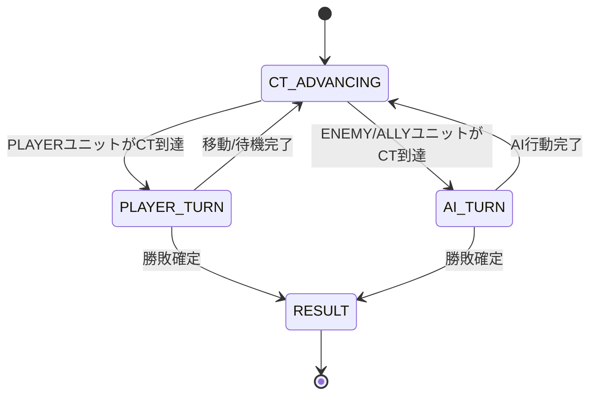

# 08. バトルUI仕様

## 画面構成

BattleScreen はタクティカル戦闘画面で、以下の要素で構成される。

| 要素 | 描画方法 | 説明 |
|------|---------|------|
| マップグリッド | ShapeRenderer（line） | 48×48px グリッド線 |
| 地形 | ShapeRenderer（filled） | 地形タイプごとの色分け |
| ユニット | ShapeRenderer（filled） | 陣営カラー × 職業別シェイプ |
| 移動範囲 | ShapeRenderer（filled） | 半透明青の矩形 |
| ステータスパネル | ShapeRenderer + BitmapFont | 選択ユニットの詳細情報 |
| ラウンド情報 | BitmapFont | ラウンド数・アクティブユニット名 |

## 座標系

- **画面向き**: 縦画面（Portrait）固定。仮想解像度 1080×1920（`GameConfig.VIRTUAL_WIDTH` × `GameConfig.VIRTUAL_HEIGHT`）
- **ExtendViewport**: マップサイズ（タイル数 × 64px）に動的適応。マップ全体 + 余白（タイル1個分）が最小表示範囲となり、画面アスペクト比に応じてビューポートが拡張される。レターボックス（黒帯）が発生せず、スマホの画面いっぱいにマップが表示される。
- **カメラ**: マップ中央に固定（`centerCameraOnMap()`）
- **タイルサイズ**: 64×64 ピクセル（`GameConfig.TILE_SIZE`）
- **タッチ座標変換**: `viewport.unproject()` でスクリーン座標 → ワールド座標
- **UI要素配置**: カメラ位置と `viewport.worldWidth/Height` から相対位置で計算

## 地形の色分け

| 地形タイプ | 色 | RGB |
|-----------|-----|-----|
| PLAIN | 薄緑 | (0.6, 0.8, 0.4) |
| FOREST | 深緑 | (0.2, 0.6, 0.2) |
| MOUNTAIN | 灰色 | (0.5, 0.5, 0.5) |
| RIVER | 青 | (0.3, 0.5, 0.9) |
| FORT | 茶色 | (0.6, 0.4, 0.2) |
| WALL | 暗灰 | (0.3, 0.3, 0.3) |

## ユニットの描画

### 陣営カラー

| 陣営 | 色 | RGB |
|------|-----|-----|
| PLAYER | 青 | (0.2, 0.4, 1.0) |
| ENEMY | 赤 | (1.0, 0.2, 0.2) |
| ALLY | 緑 | (0.2, 1.0, 0.4) |

### 職業別シェイプ

各兵種に固有の形状を割り当て、マップ上でユニットを視覚的に区別する。
描画は `UnitShapeRenderer`（`com.tacticsflame.render`）が担当。

| 兵種 | 形状 | 視覚的理由 |
|------|------|-----------|
| ロード | ◇ ひし形 | 王者の象徴 |
| ソードファイター | ▲ 上向き三角 | 剣の切っ先 |
| ランサー | △ 細い三角 | 槍の穂先 |
| アクスファイター | ■ 正方形 | 力強い安定感 |
| アーチャー | ◇ 横長ひし形 | 矢じりの形 |
| メイジ | ⬡ 六角形 | 魔法陣 |
| ヒーラー | ✚ 十字形 | 回復のシンボル |
| ナイト | ⬠ 五角形 | 騎士の盾 |
| ペガサスナイト | ↑ 上向き矢印 | 飛行のイメージ |
| アーマーナイト | 八角形 | 重厚な鎧 |

- **基準半径**: `tileSize / 3`（≈ 21px）、各形状で 1.05～1.15 倍にスケール
- **ベース円**: 形状描画前に暗色の円 (0.12, 0.12, 0.18) でCTリング内側をカバー
- **行動済み**: **半透明**（alpha 低下）で表示
- **正多角形**（五角形・六角形・八角形）: 共通ヘルパー `drawRegularPolygon()` で描画

### HPバー（ユニット下部）

各ユニットの下に小さな直線バーで現在HPを表示。

| 項目 | 値 |
|------|------|
| バー幅 | `tileSize * 0.7` |
| バー高さ | 4px |
| 位置 | ユニット中心から `tileSize/2 - 2` 下 |
| 背景色 | 暗灰 (0.15, 0.15, 0.15) |

| HP割合 | 色 | RGB |
|--------|------|-----|
| 50%以上 | 緑 | (0.2, 0.9, 0.2) |
| 25〜50% | 黄 | (0.9, 0.9, 0.1) |
| 25%未満 | 赤 | (0.9, 0.2, 0.2) |

### 円形CTバー（ユニット周囲）

各ユニットの周囲にリング状の円形ゲージでCTを表示。360°全体が埋まるとCT=100。

| 項目 | 値 |
|------|------|
| リング外径 | `tileSize * 0.42`（≈ 27px） |
| リング内径 | `tileSize / 3`（≈ 21px、ユニット円が覆う） |
| 開始位置 | 上（90°） |
| 充填方向 | 反時計回り |
| 背景色 | 暗灰 (0.15, 0.15, 0.15) |

| CT割合 | 色 | RGB |
|--------|------|-----|
| 80%以上 | 金色（もうすぐ行動） | (1.0, 0.9, 0.2) |
| 50%以上 | 水色 | (0.3, 0.8, 1.0) |
| 50%未満 | 淡緑 | (0.4, 0.7, 0.4) |

描画原理: 扇形（`ShapeRenderer.arc`）をCT割合に応じて描画し、その上にベース円（暗色）で内側をカバーした後、職業別シェイプを重ねることでリング状の見た目を実現。

## BattleState 状態遷移



### 現在実装済みの遷移

| 遷移 | トリガー | 処理 |
|------|---------|------|
| CT_ADVANCING → PLAYER_TURN | PLAYERユニットのCT≥100 | 移動範囲を自動表示 |
| CT_ADVANCING → AI_TURN | ENEMY/ALLYユニットのCT≥100 | AI行動実行 |
| PLAYER_TURN → CT_ADVANCING | 移動可能マスをタップ | ユニット移動 → CT-=100 |
| PLAYER_TURN → CT_ADVANCING | 現在位置タップ | 待機 → CT-=100 |
| PLAYER_TURN → ステータス表示 | 範囲外ユニットタップ | inspectedUnit にセット |
| AI_TURN → CT_ADVANCING | AI行動完了 | 勝敗判定 → 次のCT進行 |
| *_TURN → RESULT | 勝敗確定 | リザルト画面へ |

## ステータスパネル

### 表示トリガー

- 任意のユニット（敵含む）をタップすると `inspectedUnit` にセットされ表示
- 自軍ユニットの移動範囲表示中も、選択中ユニットのステータスを表示
- 空マスをタップするとパネル非表示

### パネルレイアウト

```
┌─────────────────────────────┐ ← 画面右端, Y=60
│ ユニット名                    │
│ Lv.XX  クラス名              │
│                              │
│ HP ████████░░  25/30         │
│ CT ██████░░░░  65/100        │
│                              │
│ STR: 10  MAG:  5             │
│ SKL:  8  SPD: 12             │
│ LCK:  7  DEF:  6             │
│ RES:  4  MOV:  5             │
│                              │
│ 装備: 鉄の剣                  │
└─────────────────────────────┘
```

| 項目 | 位置 | 説明 |
|------|------|------|
| パネル背景 | 右端 −10px, Y=60, W=380, H=460 | 半透明黒 (0,0,0, 0.7f) |
| ユニット名 | パネル上部 | 白色テキスト |
| Lv / クラス | 名前の下 | レベルとクラスタイプ |
| HPバー | W=300, H=20 | 残HP比率で色分け |
| CTバー | W=300, H=10 | CT比率で色分け（金/水/灰） |
| ステータス | 2列表示 | 8種の能力値 |
| 装備武器 | パネル下部 | 装備中の武器名（なければ「なし」） |

### HPバーの色分け

| HP割合 | 色 |
|--------|-----|
| 50%以上 | 緑 (0, 0.8, 0) |
| 25〜50% | 黄 (0.8, 0.8, 0) |
| 25%未満 | 赤 (0.8, 0, 0) |

## 調査パネル（ユニット情報パネル）

戦闘中に任意のユニットをタップすると、画面左下にそのユニットの詳細情報パネルを表示する。
アクティブユニットのステータスパネル（右上）とは別の位置に表示され、両方同時に確認できる。

### 表示トリガー

- 任意のユニット（味方・敵・同盟）をタップすると `inspectedUnit` にセットされ表示
- アクティブユニットと同じユニットの場合は調査パネルを表示しない（重複防止）
- 撃破済みユニットは表示対象外
- 空マスまたはマップ外をタップすると非表示
- 戦闘で撃破されたユニットが調査対象の場合は自動的に非表示

### パネルレイアウト

（画面左下、panelX = viewLeft + 16, panelY = viewBottom + 16）

| 項目 | 位置 | 説明 |
|------|------|------|
| パネル背景 | 左下 +16px, W=380, H=480 | 半透明黒 (0,0,0, 0.8f) |
| ヘッダー | パネル上部 | 「INSPECT」ラベル（金色） |
| ユニット名 | ヘッダーの下 | 陣営カラーテキスト |
| Lv / クラス | 名前の下 | レベルとクラスタイプ |
| EXP | Lv の下（PLAYERのみ） | 経験値 |
| HPバー | W=348, H=12 | 残HP比率で色分け |
| CTバー | W=348, H=12 | CT比率で色分け |
| ステータス | 2列表示 | STR/MAG/SKL/SPD/LCK/DEF/RES/MOV |
| 装備武器 | パネル下部 | 武器名・Mt・Hit・Wt |

## 移動範囲の表示

- `PathFinder.findReachable()` の結果を使用
- 半透明青 `(0.3, 0.3, 0.9, 0.3f)` で移動可能マスを塗りつぶし
- 選択解除または移動実行で消去

## ラウンド・行動情報表示

- 画面上部中央に `"Round X"` および `"ユニット名 のターン"` を表示
- 行動中ユニット名は陣営カラーで表示
- BitmapFont のデフォルトフォントを使用

## 行動順キュー表示

- 画面左側にパネル表示
- 今後行動し8ユニットを順番に表示
- 陣営カラー（青=PLAYER、赤=ENEMY、緑=ALLY）で色分け
- 先頭ユニットは `>> ユニット名` 形式で表示

## アクティブユニット表示

- 行動中のユニットにCTリングの外側に金色のリングを描画
- 半径: `tileSize / 2.2f`（≈ 29px）
- 色: (1.0, 0.85, 0.1)

## タッチ入力処理

| 状態 | タップ対象 | 処理 |
|------|-----------|------|
| 全状態（RESULT除く） | ユニット | 調査パネル表示（inspectedUnit にセット） |
| 全状態（RESULT除く） | 空マス / マップ外 | 調査パネル非表示（inspectedUnit = null） |
| RESULT | 任意 | リザルト画面へ遷移 |

## レンダリングパイプライン

描画順序（後のものが手前に描画される）:

1. **地形** — ShapeRenderer (Filled)
2. **移動範囲ハイライト** — ShapeRenderer (Filled, alpha)
3. **グリッド線** — ShapeRenderer (Line)
4. **ユニット** — ShapeRenderer (Filled, アクティブ金色リング → 円形CTバー → ベース円 → 職業別シェイプ → HPバー)
5. **ステータスパネル** — ShapeRenderer (Filled) + BitmapFont
6. **調査パネル** — ShapeRenderer (Filled) + BitmapFont
7. **行動順キュー** — ShapeRenderer (Filled) + BitmapFont
8. **ラウンド情報テキスト** — BitmapFont

## 未実装の項目

- [ ] アクション選択メニュー（攻撃/待機/アイテム）
- [ ] 攻撃範囲の赤色ハイライト表示
- [ ] 戦闘アニメーション（BATTLE_ANIMATION状態）
- [ ] 戦闘予測パネル（攻撃前のダメージ/命中率表示）
- [ ] マップのスクロール/ズーム
- [ ] カーソル表示（選択中マスのハイライト）
- [ ] 経験値/レベルアップの演出
- [ ] 勝利/敗北のリザルト画面
- [ ] BGM / SE 再生
- [ ] スプライト/テクスチャによるユニット・地形描画
