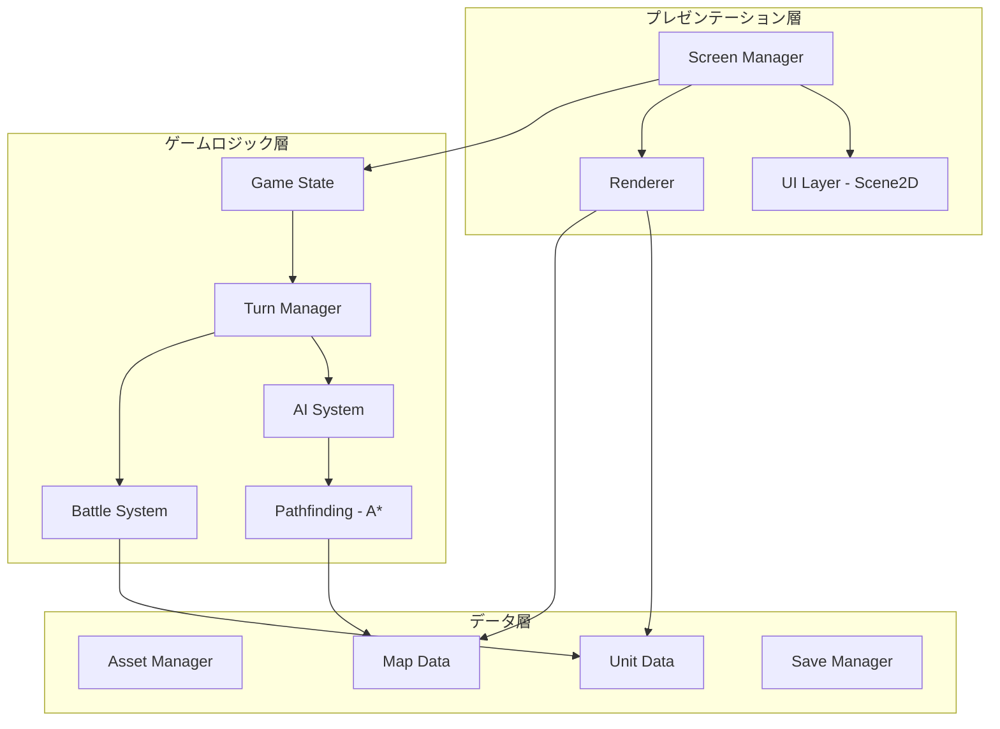
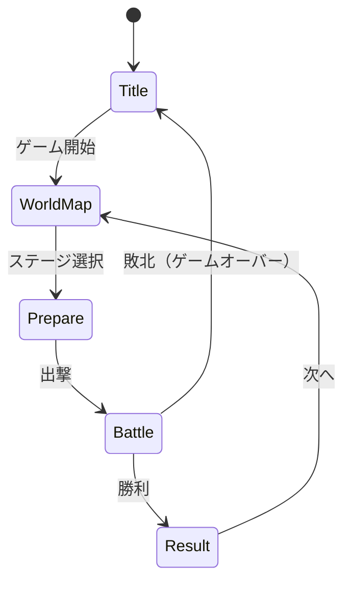
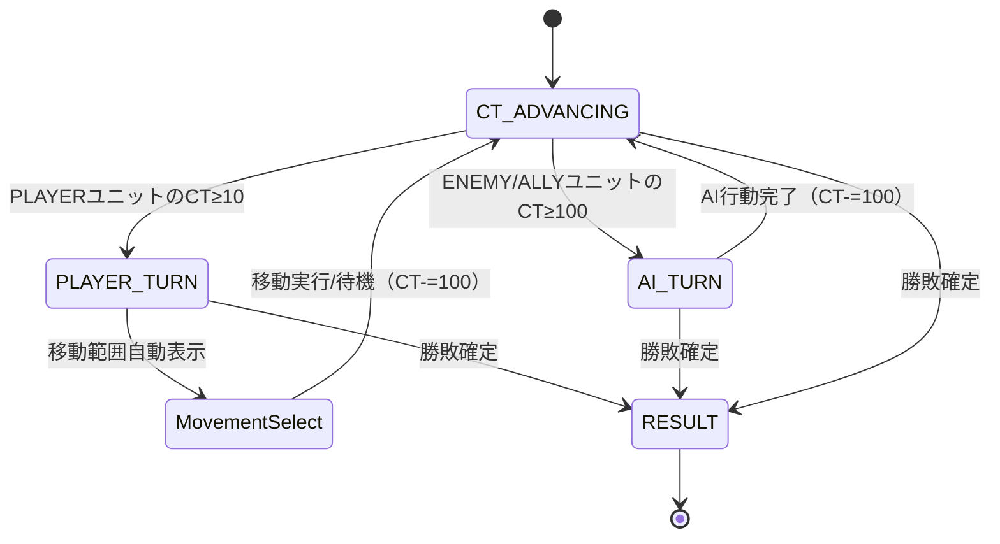

# 技術設計書（Technical Design Document）

## 1. 技術スタック

| 項目 | 技術 |
|------|------|
| 言語 | Kotlin |
| ゲームフレームワーク | LibGDX 1.12+ |
| ビルドツール | Gradle (Kotlin DSL) |
| 対象プラットフォーム | Android (API 26+) / Desktop（開発用） |
| IDE | Android Studio / IntelliJ IDEA |
| アーキテクチャ | ECS（Entity-Component-System）ベース |
| DI | 手動DI（軽量に保つ） |
| データ形式 | JSON（マップ・ユニットデータ） |
| セーブ | SharedPreferences + JSON シリアライズ |

## 2. アーキテクチャ概要



## 3. パッケージ構成

```
com.tacticsflame/
├── TacticsFlameGame.kt          # メインゲームクラス（Game継承）
├── core/
│   ├── GameConfig.kt             # ゲーム設定定数
│   └── AssetPaths.kt             # リソースパス定数
├── screen/
│   ├── TitleScreen.kt            # タイトル画面
│   ├── WorldMapScreen.kt         # ワールドマップ画面
│   ├── PrepareScreen.kt          # 出撃準備画面
│   ├── BattleScreen.kt           # バトル画面（メイン）
│   └── ResultScreen.kt           # リザルト画面
├── model/
│   ├── unit/
│   │   ├── Unit.kt               # ユニットデータクラス
│   │   ├── UnitClass.kt          # クラス（兵種）定義
│   │   ├── Stats.kt              # ステータス
│   │   ├── GrowthRate.kt         # 成長率
│   │   └── Weapon.kt             # 武器データ
│   ├── map/
│   │   ├── BattleMap.kt          # マップ全体
│   │   ├── Tile.kt               # タイルデータ
│   │   ├── TerrainType.kt        # 地形種別enum
│   │   └── Position.kt           # 座標
│   └── battle/
│       ├── BattleResult.kt       # 戦闘結果
│       ├── DamageCalc.kt         # ダメージ計算
│       └── WeaponTriangle.kt     # 武器三すくみ
├── system/
│   ├── TurnManager.kt            # ターン管理
│   ├── BattleSystem.kt           # 戦闘処理
│   ├── MovementSystem.kt         # 移動処理
│   ├── AISystem.kt               # 敵AI
│   ├── PathFinder.kt             # A*経路探索
│   ├── LevelUpSystem.kt          # レベルアップ処理
│   └── VictoryChecker.kt         # 勝敗判定
├── render/
│   ├── MapRenderer.kt            # マップ描画
│   ├── UnitRenderer.kt           # ユニット描画
│   ├── UIRenderer.kt             # UI描画
│   ├── BattleAnimRenderer.kt     # 戦闘アニメ描画
│   └── CameraController.kt       # カメラ制御
├── ui/
│   ├── HUD.kt                    # バトル中HUD
│   ├── UnitInfoPanel.kt          # ユニット情報パネル
│   ├── ActionMenu.kt             # アクション選択メニュー
│   ├── TerrainInfoPanel.kt       # 地形情報パネル
│   └── DialogBox.kt              # 会話ウィンドウ
├── data/
│   ├── MapLoader.kt              # マップJSONローダー
│   ├── UnitDataLoader.kt         # ユニットデータローダー
│   ├── SaveManager.kt            # セーブ/ロード
│   └── StageData.kt              # ステージ定義
├── input/
│   ├── BattleInputHandler.kt     # バトル画面入力処理
│   └── TouchGestureHandler.kt    # タッチジェスチャー処理
└── util/
    ├── Extensions.kt             # Kotlin拡張関数
    └── MathUtils.kt              # 数学ユーティリティ
```

## 4. 主要クラス設計

### 4.1 ステートマシン（画面遷移）


### 4.2 バトル画面ステートマシン（CTベース）


**CTシステム概要:**
- 全ユニット毎ティック `CT += SPD`
- CT ≥ 100 で行動権取得（陣営不問）
- 行動後 `CT -= 100`（余剰繰り越し）
- 優先度: CT値 > SPD値（タイブレーク）

## 5. データ形式

### マップデータ（JSON）
```json
{
  "id": "chapter_1",
  "name": "最初の戦い",
  "width": 15,
  "height": 10,
  "terrain": [
    [0, 0, 1, 1, 0, 0, 0, 2, 2, 0, 0, 0, 1, 0, 0],
    "... (各行のタイルID配列)"
  ],
  "playerSpawns": [
    {"x": 1, "y": 1},
    {"x": 2, "y": 1}
  ],
  "enemies": [
    {"classId": "swordFighter", "level": 1, "x": 10, "y": 5, "ai": "aggressive"}
  ],
  "victoryCondition": {"type": "defeatBoss", "targetId": "boss_1"},
  "defeatCondition": {"type": "lordDefeated"}
}
```

### ユニットデータ（JSON）
```json
{
  "id": "hero_01",
  "name": "アレス",
  "classId": "lord",
  "level": 1,
  "stats": {"hp": 20, "str": 6, "mag": 1, "skl": 7, "spd": 8, "lck": 5, "def": 5, "res": 2},
  "growthRates": {"hp": 3.70, "str": 1.20, "mag": 0.10, "skl": 0.55, "spd": 0.20, "lck": 0.40, "def": 0.35, "res": 0.25},
  "weapons": ["ironSword"],
  "mov": 5
}
```

### ランダム敵レベル算出基準（another_chapter）

- ランダム敵生成時の基準レベルは、出撃中味方ユニットの平均レベル（整数除算）を使用
- 出撃ユニットが0体の場合はフォールバックで Lv.1 を使用
- 敵レベルは `maxOf(1, averageLevel)` で下限を1にクランプ

### 敵成長加算方式（ランダム生成）

- ランダム敵のステータスは Lv.1 基礎値と GrowthRate から算出
- 加算回数はレベルアップ回数と同じ `maxOf(0, level - 1)`
- 算出式: `baseStats + growthRate × (level - 1)`

## 6. パフォーマンス目標

| 指標 | 目標値 |
|------|-------|
| FPS | 60fps 安定 |
| メモリ使用量 | 200MB 以下 |
| 起動時間 | 3秒以内 |
| APKサイズ | 50MB 以下 |
| バッテリー消費 | 低（vsync有効、不要時描画停止） |
